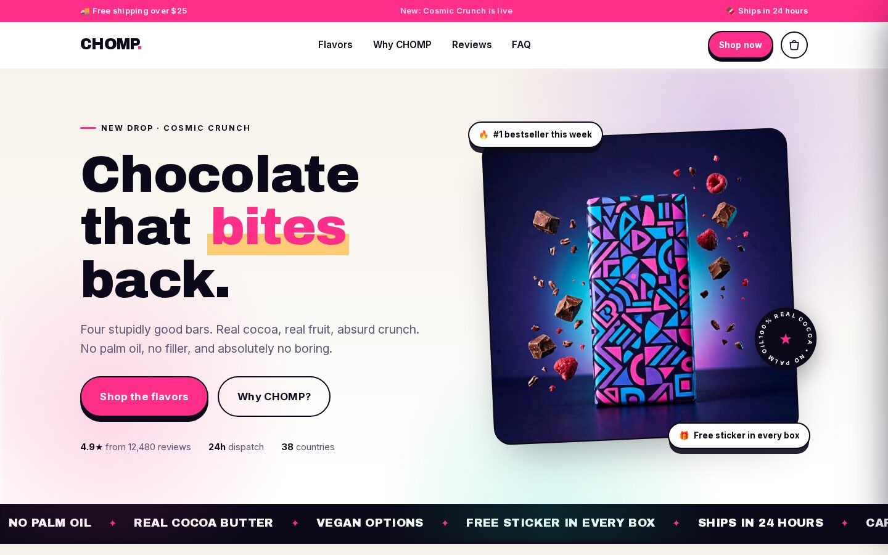
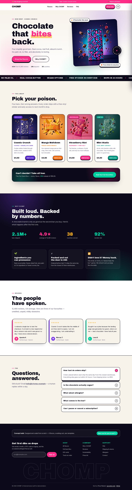
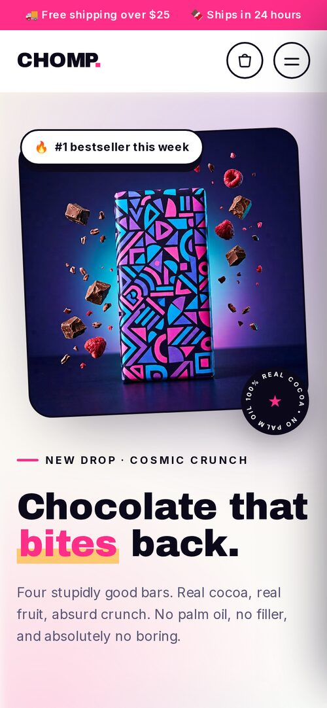

# CHOMP — Concept E-Commerce Landing Page

A complete, production-quality landing page for a fictional chocolate brand, built with **Next.js 15 (App Router) + CSS Modules**. Built as a portfolio / pitch piece to demonstrate design engineering, not just "I know Next.js."

> **Not affiliated with MrBeast, Feastables, or any real brand.** CHOMP is an original fictional brand created for demonstration. All imagery is AI-generated original artwork.



<details>
<summary><strong>More screenshots</strong> — full page &amp; mobile</summary>

<br />





</details>

---

## Quick start

```bash
npm install
npm run dev      # http://localhost:3000
npm run build    # production build
npm run start    # serve the production build
```

## What's included

| Feature | Notes |
|---|---|
| **Working cart** | Add / remove / change quantity, slide-out drawer, `localStorage` persistence |
| **Free-shipping progress bar** | Live-updating threshold logic ($25) |
| **Bundle deal button** | "Full Send Box" adds all 4 flavors in one click |
| **Scroll-reveal animations** | IntersectionObserver, no animation library |
| **Animated stat counters** | Count up when scrolled into view |
| **FAQ accordion** | Full keyboard + ARIA support (`aria-expanded`, `aria-controls`) |
| **Marquee ticker** | Pure CSS infinite loop, pauses on hover |
| **Newsletter form** | Validated, with success state |
| **Mobile menu** | Accessible, animated burger, Escape to close |
| **SEO ready** | Metadata, Open Graph, Twitter cards, per-page templates |
| **Fully responsive** | Verified at 390 / 768 / 1440px with zero horizontal overflow |
| **Accessible** | Skip link, focus-visible rings, ARIA labels, reduced-motion support |
| **Zero external requests** | Fonts self-hosted via `next/font`, all imagery local |

**Performance:** ~113 kB First Load JS, fully static-prerendered, no client-side data fetching.

---

## Project structure

```
chomp-landing/
├── app/
│   ├── layout.jsx          # Shell: fonts, metadata, providers, header/footer
│   ├── page.jsx            # Section composition (edit order here)
│   └── globals.css         # Design tokens + shared classes
├── components/
│   ├── Header.jsx          # Sticky nav + cart button + mobile menu
│   ├── Hero.jsx            # Above-the-fold + marquee
│   ├── Flavors.jsx         # Product grid + bundle CTA
│   ├── Stats.jsx           # Animated counters + value props
│   ├── Testimonials.jsx    # Review cards
│   ├── Faq.jsx             # Accordion
│   ├── Footer.jsx          # Newsletter + links + your credit line
│   ├── CartContext.jsx     # Cart state, localStorage, drawer control
│   ├── CartDrawer.jsx      # Sliding cart panel
│   ├── Reveal.jsx          # Scroll-reveal wrapper
│   └── Marquee.jsx         # Reusable ticker
├── data/flavors.js         # 👈 EDIT PRODUCTS HERE
└── public/images/          # Product photography
```

---

## Customising it (for your next client)

### 1. Your details are already set up ✅

`components/Footer.jsx` credits **Abdulrehman**, links to **github.com/Mani91050**, and
mailto's **rehmanishtiaq9105@gmail.com** — in both the pitch-strip button and the footer
credit line. Nothing left to fill in except your deployed URL.

```jsx
<p className={styles.credit}>
  Built by <strong>Abdulrehman</strong> ·{' '}
  <a href="https://github.com/Mani91050">GitHub</a> ·{' '}
  <a href="mailto:rehmanishtiaq9105@gmail.com">rehmanishtiaq9105@gmail.com</a>
</p>
```
```

### 2. Swap products

Everything lives in `data/flavors.js`. Adding a flavor automatically updates the grid, the cart, and the bundle math — no other file changes needed:

```js
{
  id: 'caramel',
  name: 'Caramel Chaos',
  tag: 'Salted caramel core',
  price: 4.5,
  color: '#c2410c',      // accent used for badge + button
  soft: '#fff1e2',       // card image background tint
  img: '/images/flavor-caramel.jpg',
  blurb: 'One-line hook.',
  badge: 'New drop',
}
```

Drop a square product photo into `public/images/` and you're done.

### 3. Rebrand the colors

Every color is a CSS variable in `app/globals.css`:

```css
:root {
  --pink: #ff2e88;    /* primary accent */
  --violet: #7c3aed;
  --mint: #00d0a0;
  --gold: #ffb020;
  --ink: #0c0a1a;     /* near-black, used for borders/type */
  --cream: #f7f2ea;   /* section background */
}
```

Change those five values and the entire site rebrands consistently.

### 4. Update links

The only remaining placeholder is `chomp-demo.vercel.app` in `app/layout.jsx` → `metadataBase`.
Once you deploy, change it to your real URL so social-share previews resolve correctly.
Brand links (`All flavors`, `FAQ`, etc.) and the fake brand address `hello@chomp.example`
live in the `COLUMNS` array in `components/Footer.jsx` — those are part of the demo brand,
so leave them unless you're adapting this for a client.

---

## Deploying (pick one, all free)

**Vercel** — fastest for Next.js:
```bash
npm i -g vercel && vercel --prod
```

**Netlify** — add `output: 'export'` to `next.config.mjs`, then:
```bash
npm run build && npx netlify deploy --prod --dir=out
```

**Your own VPS / any Node host:**
```bash
npm run build && npm run start   # runs on port 3000
```

Then add the URL to your email footer and LinkedIn.

---

## Publishing notes

- **Screenshot it.** Take a 1200×630 crop for the email/LinkedIn preview image.
- **Never claim it's a real brand.** The footer and README state it's a concept — keep that line. It reads as confidence, not deception.
- **Don't ship a real checkout.** This is a front-end demo; the "Checkout" button intentionally shows a notice. No payment keys, no customer data.
- **Keep the images.** They're AI-generated originals, so there's no licensing risk in a public portfolio.

---

Built by **Abdulrehman** — [github.com/Mani91050](https://github.com/Mani91050) ·
rehmanishtiaq9105@gmail.com.
MIT licensed (see `LICENSE`): use it as a template for real client work, just swap the brand.
